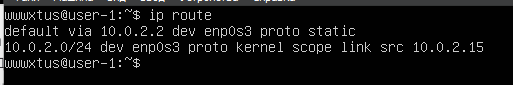
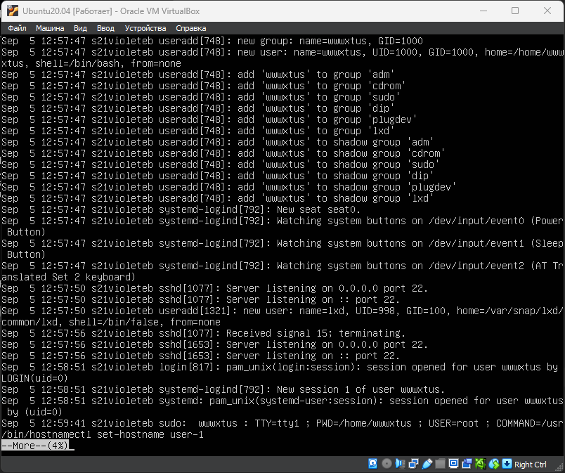

## Part 1. Установка ОС
- Проверка установленной версии\

---
## Part 2. Создание пользователя
- C помощью команды `sudo adduser school21` создам нового пользователя, а с помощью команды `sudo usermod -a -G adm school21` добавлю его в группу adm

- Вывод команды `cat /etc/passwd` после добавления нового пользователя

---
## Part 3. Настройка сети ОС
- Задал название машины вида user-1

---
- Установил временную зону, соответствующую моему текущему местоположению c помощью команды `sudo timedatectl set-timezone Europe/Moscow` .

---
- Установка `net-tools`
- `sudo apt intall net-tools`
- Вывод названия сетевых интерфейсов с помощью консольной команды.

- Один из самых основных виртуальных интерфейсов - **lo**. Это локальный интерфейс, который позволяет программам обращаться к этому компьютеру. Он используется для отладки сетевых программ и запуска серверных приложений на локальной машине. С этим интерфейсом всегда связан адрес 127.0.0.1
- Используя консольную команду `sudo dnclient -v`, получил ip адрес устройства, от DHCP-сервера.

- DHCP — протокол прикладного уровня модели TCP/IP, служит для назначения IP-адреса клиенту. Это следует из его названия — Dynamic Host Configuration Protocol. IP-адрес можно назначать вручную каждому клиенту, то есть компьютеру в локальной сети. Но в больших сетях это очень трудозатратно, к тому же, чем больше локальная сеть, тем выше возрастает вероятность ошибки при настройке. Поэтому для автоматизации назначения IP был создан протокол DHCP.
---
- Определил внешний ip-адрес шлюза (ip) и внутренний IP-адрес шлюза
	Внешний

	

	Внутренний 

	

---
- С помощью nano задал статичные настройки ip, gw, dns

- Для сохранения изменений
	`sudo netplan apply`

- Перезагружаем систему `reboot`
---
- Пингую удалённые хосты с помощью команды `ping 1.1.1.1 -c 10` 
1) 1.1.1.1

	
	
2) ya.ru

	

- На скриншоте видно, что выводе команды присутвствует фраза 0% packet loss, это свидетельствует о том, что компьютер получил ответ от всех отправленных на указанные сервера пакетов данных.
    
- Ping — утилита для проверки целостности и качества соединений в сетях. Утилита отправляет запросы указанному узлу сети и фиксирует поступающие ответы. Время между отправкой запроса и получением ответа позволяет определять двусторонние задержки по маршруту и частоту потери пакетов, то есть косвенно определять загруженность на каналах передачи данных и промежуточных устройствах.
---
## Part 4. Обновление ОС.
- Для начала обновлю командой `sudo apt update`

- Далее обновлю все системные пакеты командой `sudo apt full-upgrade`
- И запущу её ещё раз, чтобы проверить если ли обновления

- Обновления отсутствуют
---
## Part 5. Использование команды **sudo**
- Для того чтобы добавить пользователя в группу sudo нужно воспользоваться командой `sudo usermod -a -G sudo school21`
- Чтобы проверить в каких группах состоит пользователь прописал команду `groups school21`

---
- **sudo** — программа для системного администрирования UNIX-систем, позволяющая делегировать те или иные привилегированные ресурсы пользователям с ведением протокола работы. Основная идея — дать пользователям как можно меньше прав, при этом достаточных для решения поставленных задач. Команда sudo предоставляет возможность пользователям выполнять команды от имени суперпользователя root, либо других пользователей.
---
- Для начала меняю пользователя с помощью команды `su school21`
- Далее с помощью команды `sudo hoctnamectl set-hostname user-2`

- На скриншоте видно, как менялся hostname 
---
## Part 6. Установка и настройка службы времени
- Командой `date` вывожу текущее время 

- Вывожу время часового пояса

- На скриншоте видно, что `NTPSynchronized=yes`
---
## Part 7. Установка и использование текстовых редакторов
- Установил редакторы vim, nano, mcedit с помощью команд:  
1) `sudo apt install vim`
2) `sudo apt install nano`
3) `sudo apt install mcedit`
---
- Создал файл с помощью команды `touch test_X.txt`

---
### Написать свой никнейм, закрыть файл с сохранением изменений.
VIM
- Открыл файл с помощью команды `sudo vim test_X.txt`
- Записал свой никнейм

- Что выйти с сохранёнными изменениями нажал ESC и написал **:wq**

NANO
- Открыл файл с помощью команды `sudo nano test_X.txt`
- Записал свой никнейм

- Чтобы выйти с сохранёнными изменениями нажал `CTRL + S` `CTRL + X`

MCEDIT
- Открыл файл с помощью команды `sudo mcedit test_X.txt`
- Записал свой никнейм

- Чтобы выйти с сохранёнными изменениями нажал F10 и выбрал Да
---
### Открыть файл на редактирование, отредактировать файл, заменив никнейм на строку «21 School 21», закрыть файл без сохранения изменений
VIM
- Открыл файл, изменил в нём никнейм на строку 21 School 21

- Чтобы закрыть без изменений написал :q!

NANO
- Открыл файл, изменил в нём никнейм на строку 21 School 21

- Чтобы закрыть без изменений нажимаю `CTRL + X` и нажать N

MCEDIT
- Открыл файл, изменил в нём никнейм на строку 21 School 21

- Чтобы закрыть без изменений нажимаю F10 и жму Нет при вопросе нужно ли сохранять изменения в файле
---
### Отредактировать файл ещё раз, а затем с помощью функции поиска по содержимому файла заменить слово на любое другое.
VIM
- Записал и сохранил по аналогии из предыдущего задания

- Для поиска слова по файлу нажал ESC и написал /<слово>

- Для замены слова написал :s/<слово>/<слово на которое заменяю>

NANO
- Записал и сохранил по аналогии из предыдущего задания
- Для поиска слова по файлу нажал `CTRL + W`

- Для замены слова нажал CTRL + `\`

MCEDIT
- - Записал и сохранил по аналогии из предыдущего задания
- Для поиска слова по файлу нажал `F10`

- Для замены слова нажал F4

---
## Part 8. Установка и базовая настройка сервиса **SSHD**
- Устанавливаю сервис с помощью команды `sudo apt install openssh-server`

- На скриншоте ниже видно, что служба добавлена в автозагрузку при скачивании, чтобы добавить службу в автозагрузку используется команда `sudo systemctl enable ssh` 

- Перенастрой службу SSHd на порт 2022 - чтобы перенастроить захожу в конфиг с помощью команды `sudo nano /etc/ssh/ssh_config` и меняю Port с 22 на 2022

- Обязательно нужно убрать `#` перед Port 2022
- Сохраняю изменения (CTRL + X, Y)

- Заменю ssh новым номером порта (команда `sudo ufw allow 2022/tcp`)

- Обновляю систему для того чтобы изменения вступили в силу (команда `systemctl restart sshd.service`)

---

- Используя команду ps, покажe наличие процесса sshd - с помощью команды `ps aux | grep -i ssh`

Ps - утилита для просмотра процессов в Linux
-а - выбрать все процессы, кроме фоновых 
-u - выбрать процессы пользователя 
-x - указывает на процессы без управляющего терминала 
| grep -i ssh - выводит в ввод grep только те строчки, где есть ssh с игнорированием регистра 

---
- Перезапускаю систему с помощью команды `reboot`

- Вызываю команду `netstat -tan`

- Вывод команды netstat -tan содержит 
  `tcp 0 0 0.0.0.0:2022 0.0.0.0:* LISTEN`
- Команда netstat— это команда командной строки, используемая для отображения _очень_ подробной информации о том, как ваш компьютер взаимодействует с другими компьютерами или сетевыми устройствами.
-a - Вывод всех активных подключений TCP и прослушиваемых компьютером портов TCP и UDP. -n - Вывод активных подключений TCP с отображением адресов и номеров портов в числовом формате без попыток определения имен. Тогда, если netstat -na - просмотр всех открытых протоколов, то netstat -tan - просмотр всех открытых ТСР-протоколов.

При вызове команды в терминал выводится таблица: 

| Proto                       | Recv-Q                                                                                                                                                                                       | Send-Q                                                                                                                                                                             | Local Address                                                                                                                                                                                                                                                                                                 | Foreign Address                                                                                                                                                                                                                                                                                                             | State                                     |
| --------------------------- | -------------------------------------------------------------------------------------------------------------------------------------------------------------------------------------------- | ---------------------------------------------------------------------------------------------------------------------------------------------------------------------------------- | ------------------------------------------------------------------------------------------------------------------------------------------------------------------------------------------------------------------------------------------------------------------------------------------------------------- | --------------------------------------------------------------------------------------------------------------------------------------------------------------------------------------------------------------------------------------------------------------------------------------------------------------------------- | ----------------------------------------- |
| Cетевой протокол (tcp, udp) | Количество байтов, помещённых в буфер приёма TCP/IP, но не переданных приложению. Если это число высокое, то нужно проверить работоспособность приложения, которое работает с данным портом. | Количество байтов, помещённых в буфер отправки TCP/IP, но не отправленных, или отправленных, но не подтверждённых. Высокое значение может быть связано с перегрузкой сети сервера. | Локальный адрес сервера. В обычных соединениях, это адрес сервера на который пришло соединение. В прослушиваемых портах (LISTEN) — это диапазон адресов. Так 0.0.0.0:port — значит подключаться можно ко всем адресам сервера, а 192.168.0.35:port — значит подключаться можно только к этому адресу сервера. | Адрес второй стороны. В обычных соединениях, это адрес с которого пришло соединение. В прослушиваемых портах (LISTEN) — это диапазон адресов. Так 0.0.0.0: *  — значит подключаться можно с любых адресов и с любых портов, а например 192.168.0.50: *  — значит подключаться можно только с этого адреса и с любых портов. | Состояние подключения, или прослушивания. |

## Part 9. Установка и использование утилит **top**, **htop**

- Вывод команды top

Вывод команды htop:

---
По выводу команды top определил:
- uptime - 10 минут
- количество авторизованных пользователей - 1 пользователь
- среднюю загрузку системы - 1 минута: 0.00; 5 минут: 0.03; 15 минут: 0.04 
- общее количество процессов - 160
- загрузку cpu - 0.3%
- загрузку памяти - 196.8 
- pid процесса занимающего больше всего памяти - 166
- pid процесса, занимающего больше всего процессорного времени - 1

---
Чтобы отсортировать htop нужно нажать F6 и выбрать по какому параметру сортировать 
Вывод команды htop: 

- Отсортированный по PID

- Отсортированный по PERCENT_CPU

- Отсортированный по PERCENT_MEM

- Отсортированный по TIME;

- Отфильтрованному для процесса sshd;
Чтобы отфильтровать нужно нажать F4 и написать название процесса `sshd`

- С процессом syslog, найденным, используя поиск;
Чтобы начать поиск нужно нажать F3 и написать название процесса 

- С добавленным выводом hostname, clock и uptime.
Чтобы добавить различные параметры нужно нажать F2 и выбрать куда их вставлять, я вставил справа сверху, на скриншоте это представлено 

---

## Part 10. Использование утилиты **fdisk**

- Запустил команду fdisk -l.

- В отчёте напиши название жесткого диска - VBOX HARDDISK (/dev/sda)
- Его размер - 25 GB
- Количество секторов - 52428800 

- Чтобы узнать размер swap пишем `free -h`

- Размер swap - 0 B 

## Part 11. Использование утилиты **df**

- Запустил команду df

- Для корневого раздела

- В отчёте запишу для корневого раздела (/):
    - размер раздела - 11758760 
    - размер занятого пространства - 280136
    - размер свободного пространства 8309516
    - процент использования - 26%
- Определи и напиши в отчёт единицу измерения в выводе.
	- Килобайты
---
- Запустил команду df -Th.
 

- Для корневого раздела 

- В отчёте напиши для корневого раздела (/):
    - размер раздела - 12 GB
    - размер занятого пространства - 2.7 GB
    - размер свободного пространства - 8 GB
    - процент использования - 25%
- Определи и напиши в отчёт тип файловой системы для раздела.
	- Тип файловой системы: Ext4 - журналируемая файловая система, используемая в ОС на ядре Linux. Основана на файловой системе Ext3, но отличается тем, что в ней представлен механизм записи файлов в непрерывные участки блоков (екстенты), уменьшающий фрагментацию и повышающий производительность.

## Part 12. Использование утилиты **du**

- Вывод команды du

- Вывод размер папки /home (в байтах, в человекочитаемом виде).

- Вывод размер папки /var (в байтах, в человекочитаемом виде).

- Вывод размер папки /var/log (в байтах, в человекочитаемом виде).

## Part 13. Установка и использование утилиты **ncdu**
- С помощью команды `sudo apt install ncdu` установил утилиту 
- Командой `ncdu /home` узнал размер

 
- Командой `ncdu /var` узнал размер

- Командой `ncdu /var/log` узнал размер

- На скриншотах видно, что размеры совпадают с размерами из Part 12

## Part 14. Работа с системными журналами

Открыл для просмотра с помощью команды `more <нужный файл>:

1. /var/log/dmesg

 2. /var/log/syslog

3. /var/log/auth.log

---
- Напиши в отчёте 
	- время последней успешной авторизации - 12:58:51 
	- имя пользователя - wwwxtus
	- метод входа в систему - by (uid = 0)
---
- Перезапустил службу SSHd и нашёл сообщение о рестарте службы 

## Part 15. Использование планировщика заданий **CRON**

Используя планировщик заданий, запусти команду uptime через каждые 2 минуты.
- С помощью команды `crontab -e` открываю CRON 
- С помощью NANO добавляю строчку для автозапуска команды uptime (`*/ 2 * * * * /usr/bin/uptime`)

- Найди в системных журналах строчки (минимум две в заданном временном диапазоне) о выполнении.

- Удалил все задания из планировщика заданий `crontab -r`

- Cписок текущих заданий для CRON `crontab -l`

